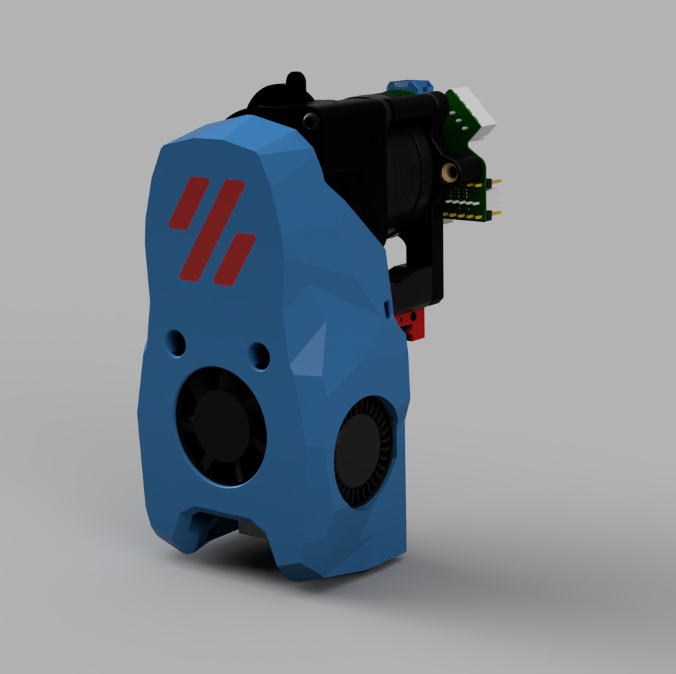

# Voron Mini Stealthburner LGX-Lite with Klicky

This mod is based upon [Maverick's design](https://github.com/VoronDesign/VoronUsers/tree/master/printer_mods/Maverick/MiniSB_LGX_Lite) to fit in the LGX-Lite into the Mini Stealthburner. I took the CAD of Maverick and adopted my Klicky which ist based on the Side-Swipe-Nozzle-Brush and the Zero Klick.

    

All needed STL inside. All parts fit on the V0.1's printbed!

CAD is only based on MGN9, but there is also a MGN7 version in the STL folder. There is also EBB36 added in the CAD. STL for mounting is in the STL folder as well, but feel free to stay with the original strain-relief-bracket. It will also fit.

Config for Klicky is included, but you have to check your pin for Klicky. The macros are running fine, but this cfg is still under development to make it as easy as possible for you to integrate into your system.

## Parts Required

BOM ist still in progress. Please be pationed.

## Printing
- Print using standard Voron part settings and in the orientation used in the STL
- No supports required
